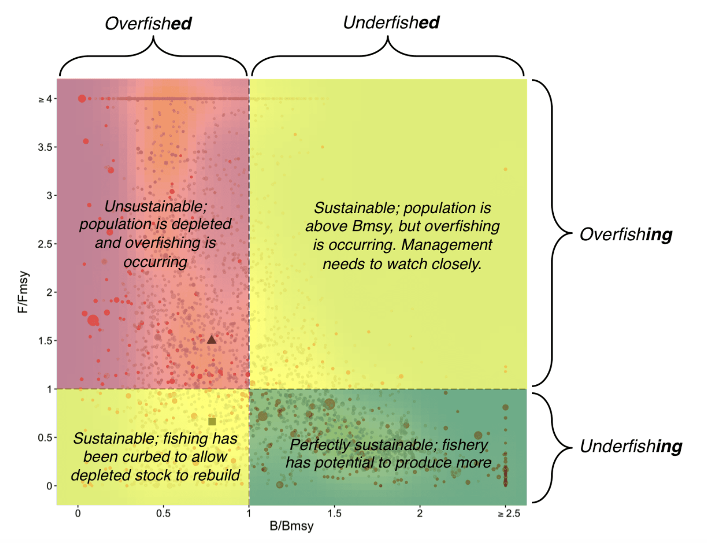
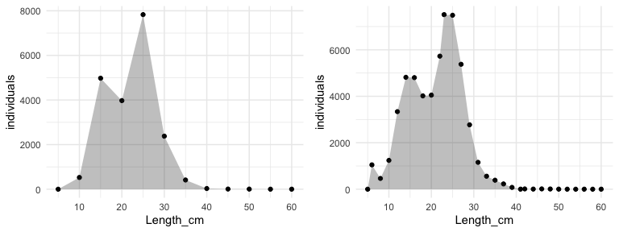
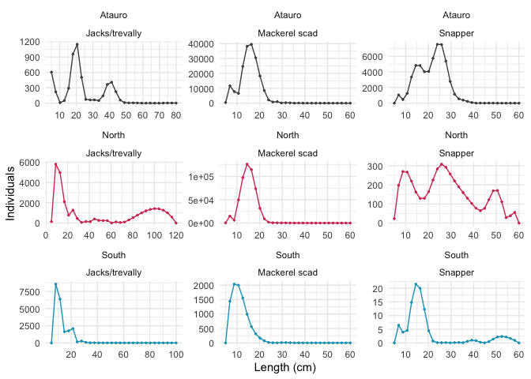
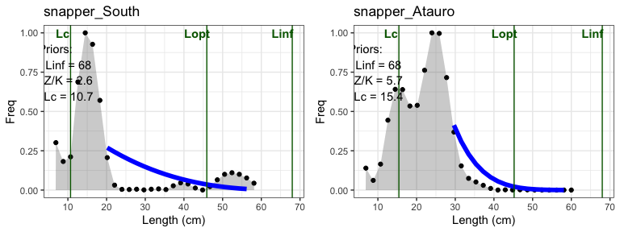
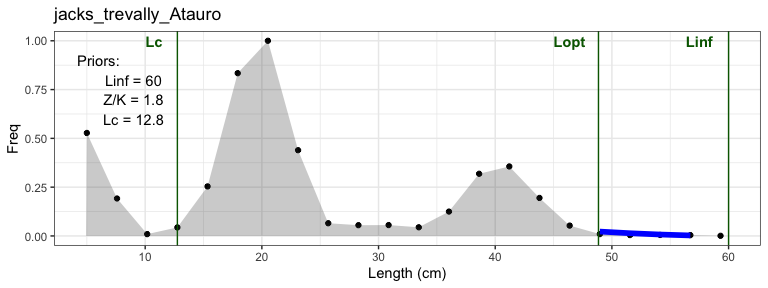
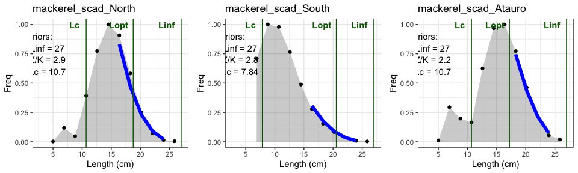
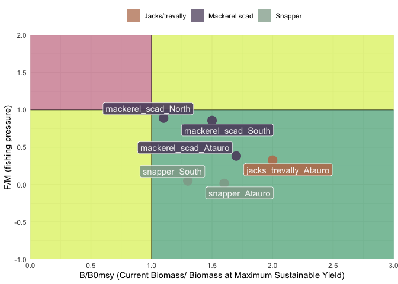

Timor stock assessment
================

## Method

Stock status indicators for each species in each area were calculated
using the LBB method proposed in [Froese et al.,
2018](https://academic.oup.com/icesjms/article/75/6/2004/5051296?login=false),
a technique for estimating stock status based on length-frequency data.
This method is applicable to species that continue to grow throughout
their lives, such as most commercially exploited fish and invertebrates.
These species require no additional input other than the
length-frequency (LF) data. The LBB estimates various parameters for one
or multiple LF samples that represent the population, including
asymptotic length (**Linf**), mean length at first capture (**Lc**),
relative natural mortality (**M/K**), and relative fishing mortality
(**F/M**).

Below the main indicators of the assessment, useful for interpretation
in the results section:

- Linf**: a**symptotic length

- Lc: mean length at first capture, or length at which 50% of the
  individuals are retained by the gear

- Lopt: length class with the highest biomass in an unfished population.
  A fishery would obtain the maximum possible yield if it were to catch
  only fish of this size.

- M/K: relative natural mortality

- F/M: relative fishing mortality (fishing pressure)

- B/B0: current biomass relative to unfished biomass

- B/Bmsy: ratio between the observed biomass and the biomass that would
  provide the maximum sustainable yield (equal or higher than 1 in case
  of sustainable fishery)

We can plot the F/Fmsy ratio against the B/Bmsy ratio to get a sense of
the sustainability of a fishery. From
<https://sustainablefisheries-uw.org/seafood-101/overfished-overfishing-rebuilding-stocks/>:

*Overfishing refers to fishing mortality (F), or the rate of fish killed
by catching them (just think of this as the proportion of fish caught).
There is an ideal proportion of fish to catch that will produce MSY—this
is called FMSY. If the proportion of fish caught (F) is greater than
FMSY, overfishing is happening. If F is less than FMSY, underfishing is
happening. Fishing mortality is usually given as a ratio of F/FMSY; a
ratio over 1 means overfishing.*

*Overfished refers to the biomass (B) of a population, or stock, of
fish. This is the amount of fish in the water. There is some amount of
biomass, B, that will produce MSY—this is BMSY. If the biomass of fish
in the water is well below BMSY, the stock is overfished, or depleted.
If the amount of fish in the water is more than would produce MSY it is
underfished. The ratio of B/BMSY is commonly used, though the number of
demarcation varies by governing body (B may represent spawning biomass,
vulnerable biomass, or total stock biomass).*

### Data

Analyses were performed on the lLF data of 3 fish groups (Snappers,
Jacks/trevally and mackerel scad) over the period 2018-2022. For each
fish group (FG), 3 stocks were defined on a geographical basis: north
coast, south coast and Atauro.

Since that the goal is to obtain the stock assessment in each area, the
analysis was conducted by combining data from all the years of in order
to gain a comprehensive understanding of the overall situation. This
means that the LF curves of each FG refer to a period of 4 years.

The population parameters for each FG wet set as follows:

|  Fish groups   | Lm (length at first maturity) | Linf (asymptotic length) |
|:--------------:|:-----------------------------:|:------------------------:|
|    Snapper     |              25               |            68            |
| Mackerel scad  |              15               |            27            |
| Jacks/Trevally |              23               |            60            |

In order to obtain a higher resolution in the length intervals, the LF
curves were spline interpolated. Below is an example of interpolation
performed on the snapper stock at Atauro. The comparison is between the
original data (left) and the interpolated data (right).

<!-- -->

Below is the Atauro’ mackerel LF data used for the analyses and shown
for representation purposes. **Length** unit is millimeters, and
**CatchNo** represents the number of individuals.

| Stock                | Length |  CatchNo |
|:---------------------|-------:|---------:|
| mackerel_scad_Atauro |  50.00 |   437.00 |
| mackerel_scad_Atauro |  68.97 | 11672.52 |
| mackerel_scad_Atauro |  87.93 |  7814.88 |
| mackerel_scad_Atauro | 106.90 |  6546.00 |
| mackerel_scad_Atauro | 125.86 | 24715.15 |
| mackerel_scad_Atauro | 144.83 | 38237.20 |
| mackerel_scad_Atauro | 163.79 | 39531.85 |
| mackerel_scad_Atauro | 182.76 | 30513.32 |
| mackerel_scad_Atauro | 201.72 | 18297.05 |
| mackerel_scad_Atauro | 220.69 |  8520.19 |
| mackerel_scad_Atauro | 239.66 |  2145.94 |
| mackerel_scad_Atauro | 258.62 |   778.35 |
| mackerel_scad_Atauro | 277.59 |   995.82 |
| mackerel_scad_Atauro | 296.55 |   139.69 |
| mackerel_scad_Atauro | 315.52 |   302.88 |
| mackerel_scad_Atauro | 334.48 |   194.05 |
| mackerel_scad_Atauro | 353.45 |    29.91 |
| mackerel_scad_Atauro | 372.41 |    81.53 |
| mackerel_scad_Atauro | 391.38 |    27.60 |
| mackerel_scad_Atauro | 410.34 |    18.31 |
| mackerel_scad_Atauro | 429.31 |    18.21 |
| mackerel_scad_Atauro | 448.28 |     1.28 |
| mackerel_scad_Atauro | 467.24 |     5.97 |
| mackerel_scad_Atauro | 486.21 |     3.34 |
| mackerel_scad_Atauro | 505.17 |     0.83 |
| mackerel_scad_Atauro | 524.14 |     1.63 |
| mackerel_scad_Atauro | 543.10 |     0.49 |
| mackerel_scad_Atauro | 562.07 |     0.59 |
| mackerel_scad_Atauro | 581.03 |     0.76 |
| mackerel_scad_Atauro | 600.00 |     0.00 |

## Results

The plot below shows the length-frequency data for each FG in each
stock-area used for the analyses:

<!-- -->

    ## Running Jags model to fit SL and N distributions
    ## Running Jags model to fit SL and N distributions
    ## Running Jags model to fit SL and N distributions
    ## Running Jags model to fit SL and N distributions
    ## Running Jags model to fit SL and N distributions
    ## Running Jags model to fit SL and N distributions

The model returned an error when running on the following stocks (due to
the multimodal shape of LF curves?):

    ## [1] "snapper_North"        "jacks_trevally_North" "jacks_trevally_South"

### Snappers

<!-- -->

<table class="kable_wrapper">
<tbody>
<tr>
<td>

|                                                                         |
|:------------------------------------------------------------------------|
|                                                                         |
| ———————————————————————-                                                |
| Results for snapper , stock snapper_South , , Gaussian selection        |
| (95% confidence limits in parentheses) File: snapper_stock.csv          |
| ———————————————————————–                                                |
| Linf prior = 68 , SD = 0.68 (cm) (user-defined)                         |
| Z/K prior = 2.62 , SD = 1.35 , M/K prior = 1.5 , SD = 0.15              |
| General reference points:                                               |
| Linf = 68.1 (66.7-69.2) cm                                              |
| Lopt = 46 cm, Lopt/Linf = 0.67                                          |
| Lc_opt = 31 cm, Lc_opt/Linf = 0.46                                      |
| M/K = 1.45 (1.18-1.75)                                                  |
| F/K = 0.0722 (0.00286-0.483)                                            |
| Z/K = 1.54 (1.23-2.11)                                                  |
| F/M = 0.0488 (0.00201-0.35)                                             |
| B/B0 F=M Lmean=Lopt= 0.781                                              |
| B/B0 = 0.993 (-0.368-9.33)                                              |
| Y/R’ F=M Lmean=Lopt= 0.024                                              |
| Y/R’ = 9.39e-05 (-3.47e-05-0.000882) (linearly reduced if B/B0 \< 0.25) |
| GLmean/Linf= 0.23 ,SD/Linf = 0.0457                                     |
| GLmean = 15.3 ,SD = 3.11                                                |
| B/Bmsy = 1.3 ( -0.471 - 12 )                                            |

</td>
<td>

|                                                                        |
|:-----------------------------------------------------------------------|
|                                                                        |
| ———————————————————————-                                               |
| Results for snapper , stock snapper_Atauro , , Gaussian selection      |
| (95% confidence limits in parentheses) File: snapper_stock.csv         |
| ———————————————————————–                                               |
| Linf prior = 68 , SD = 0.68 (cm) (user-defined)                        |
| Z/K prior = 5.7 , SD = 1.58 , M/K prior = 1.5 , SD = 0.15              |
| General reference points:                                              |
| Linf = 68.1 (66.7-69.4) cm                                             |
| Lopt = 45 cm, Lopt/Linf = 0.66                                         |
| Lc_opt = 30 cm, Lc_opt/Linf = 0.45                                     |
| M/K = 1.52 (1.25-1.83)                                                 |
| F/K = 0.0251 (0.00118-0.129)                                           |
| Z/K = 1.55 (1.25-1.87)                                                 |
| F/M = 0.016 (0.000776-0.0858)                                          |
| B/B0 F=M Lmean=Lopt= 0.613                                             |
| B/B0 = 0.994 (-0.356-6.97)                                             |
| Y/R’ F=M Lmean=Lopt= 0.0346                                            |
| Y/R’ = 0.000201 (-7.22e-05-0.00141) (linearly reduced if B/B0 \< 0.25) |
| GLmean/Linf= 0.34 ,SD/Linf = 0.0906                                    |
| GLmean = 22.9 ,SD = 6.17                                               |
| B/Bmsy = 1.6 ( -0.581 - 11.4 )                                         |

</td>
</tr>
</tbody>
</table>

### Jacks/Trevally

<!-- -->

<table class="kable_wrapper">
<tbody>
<tr>
<td>

|                                                                                 |
|:--------------------------------------------------------------------------------|
|                                                                                 |
| ———————————————————————-                                                        |
| Results for jacks_trevally , stock jacks_trevally_Atauro , , Gaussian selection |
| (95% confidence limits in parentheses) File: jacks_stock.csv                    |
| ———————————————————————–                                                        |
| Linf prior = 60 , SD = 0.6 (cm) (user-defined)                                  |
| Z/K prior = 1.77 , SD = 0.742 , M/K prior = 1.5 , SD = 0.15                     |
| General reference points:                                                       |
| Linf = 60.1 (59.5-61) cm                                                        |
| Lopt = 49 cm, Lopt/Linf = 0.81                                                  |
| Lc_opt = 37 cm, Lc_opt/Linf = 0.61                                              |
| M/K = 0.69 (0.498-0.906)                                                        |
| F/K = 0.225 (0.0825-0.268)                                                      |
| Z/K = 0.911 (0.732-1.08)                                                        |
| F/M = 0.326 (0.0942-0.499)                                                      |
| B/B0 F=M Lmean=Lopt= 0.397                                                      |
| B/B0 = 0.815 (0.00672-1.34)                                                     |
| Y/R’ F=M Lmean=Lopt= 0.118                                                      |
| Y/R’ = 0.0292 (0.000241-0.0481) (linearly reduced if B/B0 \< 0.25)              |
| GLmean/Linf= 0.48 ,SD/Linf = 0.228                                              |
| GLmean = 29 ,SD = 13.7                                                          |
| B/Bmsy = 2 ( 0.0169 - 3.37 )                                                    |

</td>
</tr>
</tbody>
</table>

### Mackerel scads

<!-- -->

<table class="kable_wrapper">
<tbody>
<tr>
<td>

|                                                                              |
|:-----------------------------------------------------------------------------|
|                                                                              |
| ———————————————————————-                                                     |
| Results for mackerel_scad , stock mackerel_scad_North , , Gaussian selection |
| (95% confidence limits in parentheses) File: mackerel_stock.csv              |
| ———————————————————————–                                                     |
| Linf prior = 27 , SD = 0.27 (cm) (user-defined)                              |
| Z/K prior = 2.88 , SD = 0.182 , M/K prior = 1.5 , SD = 0.15                  |
| General reference points:                                                    |
| Linf = 27.3 (26.7-27.7) cm                                                   |
| Lopt = 19 cm, Lopt/Linf = 0.69                                               |
| Lc_opt = 15 cm, Lc_opt/Linf = 0.57                                           |
| M/K = 1.36 (1.04-1.6)                                                        |
| F/K = 1.22 (0.812-1.37)                                                      |
| Z/K = 2.55 (2.1-2.9)                                                         |
| F/M = 0.889 (0.593-1.18)                                                     |
| B/B0 F=M Lmean=Lopt= 0.523                                                   |
| B/B0 = 0.584 (0.275-0.816)                                                   |
| Y/R’ F=M Lmean=Lopt= 0.0459                                                  |
| Y/R’ = 0.0397 (0.0187-0.0554) (linearly reduced if B/B0 \< 0.25)             |
| GLmean/Linf= 0.63 ,SD/Linf = 0.123                                           |
| GLmean = 17.3 ,SD = 3.36                                                     |
| B/Bmsy = 1.1 ( 0.526 - 1.56 )                                                |

</td>
<td>

|                                                                              |
|:-----------------------------------------------------------------------------|
|                                                                              |
| ———————————————————————-                                                     |
| Results for mackerel_scad , stock mackerel_scad_South , , Gaussian selection |
| (95% confidence limits in parentheses) File: mackerel_stock.csv              |
| ———————————————————————–                                                     |
| Linf prior = 27 , SD = 0.27 (cm) (user-defined)                              |
| Z/K prior = 2.77 , SD = 0.0603 , M/K prior = 1.5 , SD = 0.15                 |
| General reference points:                                                    |
| Linf = 27.3 (26.9-27.8) cm                                                   |
| Lopt = 21 cm, Lopt/Linf = 0.75                                               |
| Lc_opt = 17 cm, Lc_opt/Linf = 0.62                                           |
| M/K = 0.99 (0.748-1.21)                                                      |
| F/K = 0.861 (0.238-1.24)                                                     |
| Z/K = 1.84 (1.22-2.25)                                                       |
| F/M = 0.857 (0.237-1.49)                                                     |
| B/B0 F=M Lmean=Lopt= 0.405                                                   |
| B/B0 = 0.616 (-0.0319-1.16)                                                  |
| Y/R’ F=M Lmean=Lopt= 0.0763                                                  |
| Y/R’ = 0.0312 (-0.00162-0.0591) (linearly reduced if B/B0 \< 0.25)           |
| GLmean/Linf= 0.42 ,SD/Linf = 0.193                                           |
| GLmean = 11.4 ,SD = 5.29                                                     |
| B/Bmsy = 1.5 ( -0.0787 - 2.87 )                                              |

</td>
<td>

|                                                                               |
|:------------------------------------------------------------------------------|
|                                                                               |
| ———————————————————————-                                                      |
| Results for mackerel_scad , stock mackerel_scad_Atauro , , Gaussian selection |
| (95% confidence limits in parentheses) File: mackerel_stock.csv               |
| ———————————————————————–                                                      |
| Linf prior = 27 , SD = 0.27 (cm) (user-defined)                               |
| Z/K prior = 2.18 , SD = 0.0886 , M/K prior = 1.5 , SD = 0.15                  |
| General reference points:                                                     |
| Linf = 27.1 (26.8-27.4) cm                                                    |
| Lopt = 17 cm, Lopt/Linf = 0.64                                                |
| Lc_opt = 13 cm, Lc_opt/Linf = 0.48                                            |
| M/K = 1.72 (1.53-1.9)                                                         |
| F/K = 0.658 (0.552-0.681)                                                     |
| Z/K = 2.37 (2.17-2.56)                                                        |
| F/M = 0.382 (0.302-0.436)                                                     |
| B/B0 F=M Lmean=Lopt= 0.397                                                    |
| B/B0 = 0.656 (0.468-0.774)                                                    |
| Y/R’ F=M Lmean=Lopt= 0.0326                                                   |
| Y/R’ = 0.0219 (0.0156-0.0258) (linearly reduced if B/B0 \< 0.25)              |
| GLmean/Linf= 0.77 ,SD/Linf = 0.18                                             |
| GLmean = 20.9 ,SD = 4.87                                                      |
| B/Bmsy = 1.7 ( 1.18 - 1.95 )                                                  |

</td>
</tr>
</tbody>
</table>

### Overall status

According to the significance of the indicators described in the methods
section, all stocks are in in excellent condition and have the potential
to produce more.

<!-- -->
