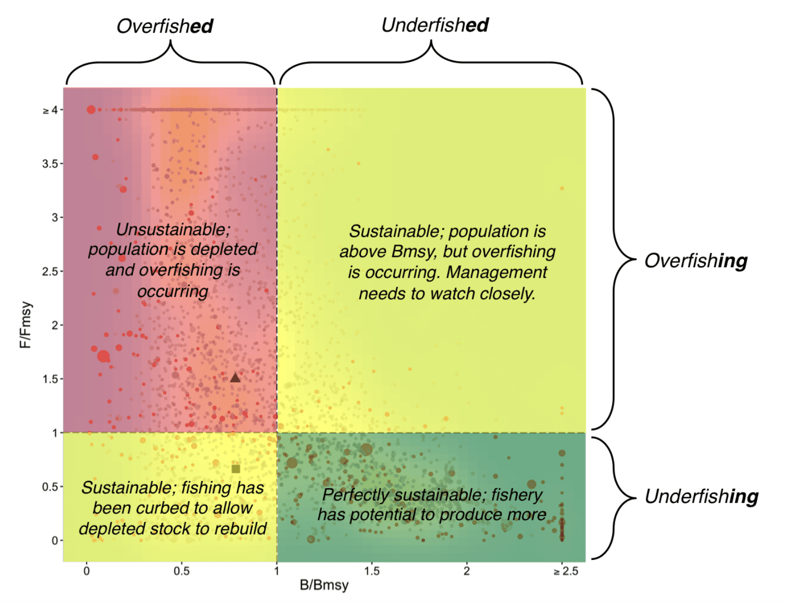

```{r setup, include=FALSE}
knitr::opts_chunk$set(echo = TRUE)
```

```{r, include=FALSE}
library(magrittr)
library(ggplot2)
library(R2jags)
library(Hmisc)
#library(kableExtra)
library(cowplot)
library(ggrepel)

trips <-
  readr::read_rds("data/all_trips__20221127180725_3711af0__.rds") %>%
  dplyr::mutate(
    area = dplyr::case_when(
      .data$reporting_region %in% c("Bobonaro", "Liquiça", "Dili", "Baucau", "Oecusse") |
        .data$landing_station %in% c(
          "Com", "Tutuala", "Ililai",
          "Sentru/Liarafa/Sika/Rau Moko", "Comando"
        ) ~ "North",
      .data$reporting_region == "Atauro" ~ "Atauro",
      is.na(.data$reporting_region) | is.na(.data$reporting_region) |
        is.na(.data$reporting_region) & is.na(.data$reporting_region) ~ NA_character_,
      TRUE ~ "South"
    )
  ) %>%
  dplyr::filter(!is.na(reporting_region) & gear_type == "gill net") %>%
  tidyr::unnest(.data$landing_catch) %>%
  tidyr::unnest(.data$length_frequency) %>%
  dplyr::select(area, landing_id, landing_date, catch_taxon, individuals, length) %>%
  dplyr::mutate(
    Year = lubridate::year(landing_date),
    length_inf = dplyr::case_when(
      length == 7.5 ~ 5,
      length == 12.5 ~ 10,
      length == 17.5 ~ 15,
      length == 22.5 ~ 20,
      length == 27.5 ~ 25,
      length == 32.5 ~ 30,
      length == 37.5 ~ 35,
      length == 42.5 ~ 40,
      length == 47.5 ~ 45,
      length == 52.5 ~ 50,
      length == 57.5 ~ 55,
      length == 57.5 ~ 55,
      length >= 60 & length < 70 ~ 60,
      length > 70 & length < 80 ~ 70,
      length > 80 & length < 90 ~ 80,
      length > 90 & length < 100 ~ 90,
      length > 100 & length < 120 ~ 100,
      length > 120 & length < 140 ~ 120,
      length > 140 & length < 160 ~ 140,
      length > 160 & length < 180 ~ 160,
      TRUE ~ length
    )
  )

area_colors <- c("#505050", "#d23f67", "#17A3BF")
species_colors <- c("#bb7e5d", "#5d4e6d", "#8fa998")

# functions

get_fish_params <- function(taxa,
                            rank = NULL,
                            country_code = NULL) {
  if (rank == "comm_name") {
    sp_list <- rfishbase::common_to_sci(taxa) %>%
      magrittr::extract2("Species") %>%
      unique()
  } else {
    sp_list <- list(taxa) %>%
      rlang::set_names(rank) %>%
      do.call(rfishbase::species_list, .) %>%
      unique()
  }

  country_table <- sp_list %>%
    rfishbase::country()

  specs <- country_table %>%
    dplyr::filter(.data$C_Code %in% country_code) %>%
    magrittr::extract2("Species") %>%
    unique()

  # If its not found in the country just get them all. THis is because it's
  # likely the species is present but there are no museum records in the
  # FishBase database
  if (length(specs) == 0) {
    specs <- country_table %>%
      magrittr::extract2("Species") %>%
      unique()
  }

  mat_dat <- rfishbase::maturity(species_list = specs) %>%
    dplyr::select(spe = Species, Lm_mat = Lm)

  growth_dat <- rfishbase::popgrowth(species_list = specs) %>%
    dplyr::select(spe = Species, Lm, LinfLmax, TLinfinity)

  dplyr::left_join(mat_dat, growth_dat, by = "spe")
}

get_lf <- function(data = NULL,
                   taxa = NULL,
                   summ_individuals = TRUE,
                   multiple_years = FALSE,
                   area_colors = c("#505050", "#d23f67", "#17A3BF")) {
  if (taxa == "SNA") {
    common_name <- "snapper"
    title <- "Snapper"
  } else if (taxa == "SDX") {
    common_name <- "mackerel_scad"
    title <- "Mackerel scad"
  } else {
    common_name <- "jacks_trevally"
    title <- "Jacks/trevally"
  }

  catch_df <-
    data %>%
    dplyr::filter(catch_taxon == taxa & !is.na(individuals)) %>%
    dplyr::mutate(
      Stock = paste(common_name, area, sep = "_"),
      length_inf = length_inf * 10
    ) %>%
    dplyr::select(
      Stock,
      Year,
      area,
      catch_taxon,
      Length = length_inf,
      CatchNo = individuals
    ) %>%
    dplyr::ungroup() %>%
    dplyr::arrange(Year, Stock) %>%
    dplyr::arrange(Length)

  if (isFALSE(multiple_years)) {
    catch_df <-
      catch_df %>%
      dplyr::mutate(Year = rep("2022"))
  }

  if (isTRUE(summ_individuals)) {
    catch_df <-
      catch_df %>%
      dplyr::group_by(Stock, Year, area, catch_taxon, Length) %>%
      dplyr::summarise(CatchNo = sum(CatchNo)) %>%
      dplyr::ungroup()
  }
  catch_df
}

spline_series <- function(data = NULL, stock = NULL, s_param = 30) {
  dat <-
    data %>%
    dplyr::filter(Stock == stock)

  spl <- spline(dat$Length, dat$CatchNo, n = s_param)

  dat_res <-
    dplyr::tibble(
      Stock = rep(stock, s_param),
      Year = rep(2022, s_param),
      area = rep(unique(dat$area), s_param),
      catch_taxon = rep(unique(dat$catch_taxon), s_param),
      Length = spl$x,
      CatchNo = abs(spl$y)
    )
  dat_res
}

extract_stock_inds <- function(text_list = NULL) {
  bb_dat <-
    dplyr::as_tibble(text_list)[22, ] %>%
    tidyr::pivot_longer(cols = dplyr::everything(), names_to = "stock") %>%
    dplyr::mutate(
      bbmsy = stringr::str_extract(value, "\\(?[0-9,.]+\\)?"),
      bbmsy = as.numeric(bbmsy)
    ) %>%
    dplyr::select(-value)

  fm_dat <-
    dplyr::as_tibble(text_list)[15, ] %>%
    tidyr::pivot_longer(cols = dplyr::everything(), names_to = "stock") %>%
    dplyr::mutate(
      fm = stringr::str_extract(value, "\\(?[0-9,.]+\\)?"),
      fm = as.numeric(fm)
    ) %>%
    dplyr::select(-value)

  dplyr::left_join(bb_dat, fm_dat, by = "stock")
}


get_stock_results <- function(stock = NULL) {
  options(digits = 3)


  # Select stock to be analysed
  Stock <- stock

  # Set working directory
  # setwd("D:/RF_Documents/LBB/Revision/")

  # Select file with stock ID info
  ID.File <- "ID_file.csv"

  # Initialize some variables
  n.sim <- 10 # ifelse(Stock %in% c("CodRedFSim"),1,10) # number of years to be created in simulations


  ##############################################################
  #  Functions
  ##############################################################
  #--------------------------------------------------------
  # Exploited B/B0 ratio from B&H equations, for variable F
  #--------------------------------------------------------
  # assuming that observed lengths are the lower bounds of length classes
  # get lowest exploited (>= 0.01 F) length class and class width

  BH <- function(AllLength, Linf, MK, FK, GausSel, selpar1, selpar2) {
    if (GausSel == F) {
      r.Lc <- selpar1
      r.alpha <- selpar2
      Lx <- AllLength[AllLength >= Linf * (r.Lc - 4.59 / r.alpha)][1]
    } else if (GausSel == T) {
      r.GLmean <- selpar1
      r.SD <- selpar2
      Lx <- AllLength[AllLength >= Linf * (r.GLmean - 3 * r.SD)][1]
    }
    class.width <- median(diff(sort(unique(AllLength))))
    FM <- FK / MK

    # Linf=120;Lx=22.5;r.Lc=0.2917;r.alpha=60;MK=1.5385;FK=0.7692;FM=0.5;ZK=2.3077
    # uncomment above row for comparison of Y'R= 0.0332, B/B0=0.467 with CodLightSim
    r <- vector() # auxilliary reduction factor
    G <- vector() # product of reduction factors
    SL.bh <- vector() # selection at length
    YR1.2 <- vector() # relative yield per recruit per length class
    CPUER1.2 <- vector() # relative CPUE per recruit per length class
    B1.2 <- vector() # relative unexploited biomass per recruit by length class
    L.bh <- seq(from = Lx, to = Linf, by = class.width) # lengths to be considered
    r.L.bh <- L.bh / Linf # standardized lengths

    # calculate selection, Y'/R and CPUE'/R for every length class
    for (o in 1:length(r.L.bh)) {
      if (GausSel == F) {
        if (o < length(r.L.bh)) {
          SL.bh[o] <- mean(c(
            1 / (1 + exp(-r.alpha * (r.L.bh[o] - r.Lc))), # mean selection in length class
            1 / (1 + exp(-r.alpha * (r.L.bh[o + 1] - r.Lc)))
          ))
        } else {
          SL.bh[o] <- 1 / (1 + exp(-r.alpha * (r.L.bh[o] - r.Lc)))
        }
      } else if (GausSel == T) { # gill net selection
        if (o < length(r.L.bh)) {
          SL.bh[o] <- mean(c(
            exp(-((r.L.bh[o] - r.GLmean)^2 / (2 * r.SD^2))), # mean selection in length class
            exp(-((r.L.bh[o + 1] - r.GLmean)^2 / (2 * r.SD^2)))
          ))
        } else {
          SL.bh[o] <- exp(-((r.L.bh[o] - r.GLmean)^2 / (2 * r.SD^2)))
        }
      } # end of calculation of selectivity loop

      if (o < length(r.L.bh)) {
        r[o] <- (1 - r.L.bh[o + 1])^(FK * SL.bh[o]) / (1 - r.L.bh[o])^(FK * SL.bh[o])
        G[o] <- prod(r[1:o])
      }
      if (o == 1) {
        YR1.2[o] <- (FM * SL.bh[o] / (1 + FM * SL.bh[o]) * (1 - r.L.bh[o])^MK * (1 - 3 * (1 - r.L.bh[o]) / (1 + 1 /
          (MK + FK * SL.bh[o])) + 3 * (1 - r.L.bh[o])^2 / (1 + 2 / (MK + FK * SL.bh[o])) -
          (1 - r.L.bh[o])^3 / (1 + 3 / (MK + FK * SL.bh[o])))) -
          (FM * SL.bh[o] / (1 + FM * SL.bh[o]) * (1 - r.L.bh[o + 1])^MK * (1 - 3 * (1 - r.L.bh[o + 1]) / (1 + 1 /
            (MK + FK * SL.bh[o])) + 3 * (1 - r.L.bh[o + 1])^2 / (1 + 2 / (MK + FK * SL.bh[o])) -
            (1 - r.L.bh[o + 1])^3 / (1 + 3 / (MK + FK * SL.bh[o])))) * G[o]
      } else if (o == length(r.L.bh)) {
        YR1.2[o] <- (FM * SL.bh[o] / (1 + FM * SL.bh[o]) * (1 - r.L.bh[o])^MK * (1 - 3 * (1 - r.L.bh[o]) / (1 + 1 /
          (MK + FK * SL.bh[o])) + 3 * (1 - r.L.bh[o])^2 / (1 + 2 / (MK + FK * SL.bh[o])) -
          (1 - r.L.bh[o])^3 / (1 + 3 / (MK + FK * SL.bh[o])))) * G[o - 1]
      } else {
        YR1.2[o] <- (FM * SL.bh[o] / (1 + FM * SL.bh[o]) * (1 - r.L.bh[o])^MK * (1 - 3 * (1 - r.L.bh[o]) / (1 + 1 /
          (MK + FK * SL.bh[o])) + 3 * (1 - r.L.bh[o])^2 / (1 + 2 / (MK + FK * SL.bh[o])) -
          (1 - r.L.bh[o])^3 / (1 + 3 / (MK + FK * SL.bh[o])))) * G[o - 1] -
          (FM * SL.bh[o] / (1 + FM * SL.bh[o]) * (1 - r.L.bh[o + 1])^MK * (1 - 3 * (1 - r.L.bh[o + 1]) / (1 + 1 /
            (MK + FK * SL.bh[o])) + 3 * (1 - r.L.bh[o + 1])^2 / (1 + 2 / (MK + FK * SL.bh[o])) -
            (1 - r.L.bh[o + 1])^3 / (1 + 3 / (MK + FK * SL.bh[o])))) * G[o]
      } # end of loop to calculate yield per length class

      CPUER1.2[o] <- YR1.2[o] / FM # CPUE/R = Y/R divided by F/M

      if (o < length(r.L.bh)) {
        B1.2[o] <- ((1 - r.L.bh[o])^MK * (1 - 3 * (1 - r.L.bh[o]) / (1 + 1 / MK) + 3 * (1 - r.L.bh[o])^2 /
          (1 + 2 / MK) - (1 - r.L.bh[o])^3 / (1 + 3 / MK)) -
          (1 - r.L.bh[o + 1])^MK * (1 - 3 * (1 - r.L.bh[o + 1]) / (1 + 1 / MK) + 3 * (1 - r.L.bh[o + 1])^2 /
            (1 + 2 / MK) - (1 - r.L.bh[o + 1])^3 / (1 + 3 / MK))) * SL.bh[o]
      } else {
        B1.2[o] <- ((1 - r.L.bh[o])^MK * (1 - 3 * (1 - r.L.bh[o]) / (1 + 1 / MK) + 3 * (1 - r.L.bh[o])^2 /
          (1 + 2 / MK) - (1 - r.L.bh[o])^3 / (1 + 3 / MK))) * SL.bh[o]
      }
    } # end of B&H loop through length classes
    BB0 <- sum(CPUER1.2) / sum(B1.2)
    YR <- sum(YR1.2)
    if (BB0 < 0.25) YR <- YR * BB0 / 0.25 # reduce YR if recruitment and thus productivity is reduced
    return(list(BB0, YR))
  } # end of BH function

  #------------------------------------------------------------
  # Function to aggregate data by year
  #------------------------------------------------------------
  AG <- function(dat) { # where dat contains dat$Year, dat$Length in cm, dat$CatchNo

    # aggregate normalized annual LFs by weighing with square root of sample size
    # get sum of frequencies per year
    sum.Ny <- aggregate(Freq ~ Year, dat, sum)$Freq
    # get the sqrt of the sum of frequencies for every year
    sqrt.Ny <- sqrt(sum.Ny)
    # get highest frequency in each year
    max.Ny <- aggregate(Freq ~ Year, dat, max)$Freq
    # get Number of Length bins in each year
    binsN <- aggregate(Freq ~ Year, dat, length)$Freq
    # create vectors for sqrt.Ni and sum.Ni to weigh LF data
    sqrt.Ni <- rep(sqrt.Ny, binsN)
    sum.Ni <- rep(sum.Ny, binsN)
    # Do weighing
    # Divide all years by sum.Ni and multiply by sqrt.Ni
    LF.w <- dat$Freq / sum.Ni * sqrt.Ni
    # Aggregate
    LF <- aggregate(LF.w, by = list(dat$Length), FUN = sum)
    # Add correct column names
    colnames(LF) <- c("Length", "Freq")
    return(LF)
  } # end of aggregate function

  #-----------------------------------------------------------
  # Function to plot LBB-fit for a single year
  #-----------------------------------------------------------
  # expects lengths relative to Linf (L/Linf)
  plot.year <- function(r.L.y, r.Freq.y, r.Lopt, SL1, SL2, MK, FK, Linf) {
    SL <- vector()
    SL[1] <- 0
    xN <- vector()
    xN[1] <- 1
    for (p in 2:length(r.L.y)) {
      if (dat.ID$GausSel == T) {
        SL[p] <- exp(-((r.L.y[p] - SL1 / Linf)^2 / (2 * (SL2 / Linf)^2))) # selection at length r.L[i]
      } else {
        SL[p] <- 1 / (1 + exp(-SL2 * (r.L.y[p] - SL1 / Linf)))
      }
      xN[p] <- xN[p - 1] * exp((MK + FK * SL[p]) * (log(1 - r.L.y[p]) - log(1 - r.L.y[p - 1])))
    } # end of loop for length classes
    # determine sum of squared residuals, store parameters if less then min of previous
    Freq.pred <- xN * SL
    sum.Freq.pred <- sum(Freq.pred)
    r.Freq.pred <- Freq.pred / sum.Freq.pred
    plot(
      x = r.L.y, y = r.Freq.pred,
      xlab = "Length / Linf", ylab = "relative Frequency",
      xlim = c(0, 1), ylim = c(0, 1.2 * max(r.Freq.y)),
      col = "red", type = "l", bty = "l", main = Year, las = 1
    )
    points(x = r.L.y, y = r.Freq.y, cex = 0.5)
    lines(x = c(1, 1), y = c(0, 1.07 * max(r.Freq.y, na.rm = T)), col = "darkgreen")
    text(x = 1, y = 1.15 * max(r.Freq.y, na.rm = T), "Linf", col = "darkgreen")
    lines(x = c(r.Lopt, r.Lopt), y = c(0, 1.07 * max(r.Freq.y, na.rm = T)), col = "darkgreen")
    text(x = r.Lopt, y = 1.15 * max(r.Freq.y, na.rm = T), "Lopt", col = "darkgreen")
    text(x = 0.15, y = 0.8 * max(r.Freq.y, na.rm = T), paste("Linf=", format(Linf, digits = 3), sep = ""))
    text(x = 0.15, y = 0.6 * max(r.Freq.y, na.rm = T), paste("Z/K=", format(MK + FK, digits = 3), sep = ""))
  }

  #############################################################
  # read files with ID and with LF data to be analyzed
  #############################################################
  # read ID data
  dat.ID <- read.csv(ID.File, header = T, stringsAsFactors = F)

  # restrict ID data to selected Stock
  dat.ID <- dat.ID[dat.ID$Stock == Stock, ]

  # read LF data
  dat.raw <- read.csv(dat.ID$File, header = T, stringsAsFactors = F)

  # restrict LF data to selected stock
  dat.raw <- dat.raw[dat.raw$Stock == Stock, ]

  # restrict analysis to one or more gears
  if (is.na(dat.ID$Gears.user[1]) == FALSE) dat.raw <- dat.raw[dat.raw$Gear %in% dat.ID$Gears.user, ]

  # make sure data are numeric
  dat.raw$Length <- as.numeric(dat.raw$Length)
  dat.raw$CatchNo <- as.numeric(dat.raw$CatchNo)
  dat.raw$Year <- as.integer(dat.raw$Year)

  # if StartYear is given, restrict data to >= StartYear
  if (is.na(dat.ID$StartYear) == F) dat.raw <- dat.raw[dat.raw$Year >= dat.ID$StartYear, ]

  # if EndYear is given, restrict data to <= EndYear
  if (is.na(dat.ID$EndYear) == F) dat.raw <- dat.raw[dat.raw$Year <= dat.ID$EndYear, ]

  # if Years.user are given, restrict data to these years
  # modification by Gianpaolo 09 07 17
  if (is.na(dat.ID$Years.user[[1]]) == F) dat.raw <- dat.raw[dat.raw$Year %in% (strsplit(dat.ID$Years.user, ","))[[1]], ]

  # if Linf.user is given, restict data to < Linf.user
  if (is.na(dat.ID$Linf.user) == F) dat.raw <- dat.raw[dat.raw$Length < (dat.ID$Linf.user * ifelse(dat.ID$mm.user == TRUE, 1, 10)), ]

  # if Lcut.user is given, restrict data to >= Lcut.user
  if (is.na(dat.ID$Lcut.user) == F) dat.raw <- dat.raw[dat.raw$Length >= (dat.ID$Lcut.user * ifelse(dat.ID$mm.user == TRUE, 1, 10)), ]

  # remove NA records
  dat.raw <- dat.raw[which(is.na(dat.raw$CatchNo) == F), ]

  # sort data by year and length
  dat.raw <- dat.raw[order(dat.raw$Year, dat.raw$Length), ]

  # Put data into vectors
  StartYear <- min(dat.raw$Year)
  EndYear <- max(dat.raw$Year)
  AllYear <- dat.raw$Year
  AllLength <- dat.raw$Length
  if (dat.ID$mm.user == FALSE) AllLength <- AllLength / 10
  AllFreq <- dat.raw$CatchNo
  Years <- sort(unique(AllYear))
  nYears <- length(Years)

  # if data are simulated, add noise and n.sim more years
  if (substr(Stock, start = nchar(Stock) - 2, stop = nchar(Stock)) == "Sim") {
    n.L.sim <- length(AllLength)
    AllYearSim <- AllYear
    AllLengthSim <- AllLength
    AllFreqSim <- rlnorm(n = n.L.sim, mean = log(AllFreq), sd = 0.1)
    if (!(Stock %in% c("CodfFSim", "CodRecSim"))) { # CodfFSim and CodRecSim are simulations that should run for only one year
      for (i in 1:(n.sim - 1)) {
        AllYearSim <- append(AllYearSim, AllYear + i)
        AllLengthSim <- append(AllLengthSim, AllLength)
        AllFreqSim <- append(AllFreqSim, rlnorm(n = n.L.sim, mean = log(AllFreq), sd = 0.1))
      }
      AllYear <- AllYearSim
      AllLength <- AllLengthSim
      AllFreq <- AllFreqSim
      Years <- sort(unique(AllYear))
      nYears <- length(Years)
      EndYear <- Years[nYears]
    }
  } # end of simulation loop

  #-----------------------------------------------------
  # plot LF for all years to detect potential problems
  #-----------------------------------------------------
  for (z in 1:ceiling(nYears / 6)) {
    # modification by Gianpaolo 09 07 17
    if (grepl("win", tolower(Sys.info()["sysname"]))) { # windows(12,8)
    } else if (grepl("linux", tolower(Sys.info()["sysname"]))) {
      X11(12, 8)
    } else {
      quartz(12, 8)
    }
    par(mfrow = c(2, 3))
    for (v in 1:6) {
      w <- v + (z - 1) * 6
      if (w > nYears) break()
      df.p <- data.frame(AllYear[AllYear == Years[w] & AllFreq > 0], AllLength[AllYear == Years[w] & AllFreq > 0], AllFreq[AllYear == Years[w] & AllFreq > 0])
      names(df.p) <- c("Year", "Length", "Freq")
      LF.p <- AG(dat = df.p) # function to aggregate data in case bins are not unique
      # plot(x=LF.p$Length,y=LF.p$Freq,xlab="",ylab="Freq",bty="l",main=Years[w],cex=0.5)
    }
  }

  #----------------------------------------------------
  # Create matrix to store annual estimates
  #----------------------------------------------------
  Ldat <- data.frame(
    Stock = rep(Stock, nYears), Year = rep(NA, nYears),
    Linf = rep(NA, nYears),
    Linf.lcl = rep(NA, nYears),
    Linf.ucl = rep(NA, nYears),
    Lc = rep(NA, nYears), # for trawl selection
    Lc.lcl = rep(NA, nYears),
    Lc.ucl = rep(NA, nYears),
    Lmean = rep(NA, nYears),
    r.alpha = rep(NA, nYears),
    r.alpha.lcl = rep(NA, nYears),
    r.alpha.ucl = rep(NA, nYears),
    r.GLmean = rep(NA, nYears), r.SD = rep(NA, nYears), # for gill net selection
    MK = rep(NA, nYears),
    MK.lcl = rep(NA, nYears),
    MK.ucl = rep(NA, nYears),
    FK = rep(NA, nYears),
    FK.lcl = rep(NA, nYears),
    FK.ucl = rep(NA, nYears),
    ZK = rep(NA, nYears),
    ZK.lcl = rep(NA, nYears),
    ZK.ucl = rep(NA, nYears),
    FM = rep(NA, nYears),
    FM.lcl = rep(NA, nYears),
    FM.ucl = rep(NA, nYears),
    r.Lopt = rep(NA, nYears),
    BB0 = rep(NA, nYears),
    BB0.lcl = rep(NA, nYears),
    BB0.ucl = rep(NA, nYears),
    YR = rep(NA, nYears),
    YR.lcl = rep(NA, nYears),
    YR.ucl = rep(NA, nYears),
    perc.mat = rep(NA, nYears),
    L95 = rep(NA, nYears)
  )


  #--------------------------------------------------------------------------------------
  # Use aggregated LF data for estimation of Linf (and overall Z/K)
  #--------------------------------------------------------------------------------------
  df <- data.frame(AllYear, AllLength, AllFreq)
  names(df) <- c("Year", "Length", "Freq")

  LF.all <- AG(dat = df) # function to aggregate data by year and across years

  # standardize to max Freq
  LF.all$Freq <- LF.all$Freq / max(LF.all$Freq)
  # remove leading empty records
  LF.all <- LF.all[which(LF.all$Freq > 0)[1]:length(LF.all$Length), ]
  # remove trailing empty records
  LF.all <- LF.all[1:which(LF.all$Length == max(LF.all$Length[LF.all$Freq > 0])), ]

  # get number of records in LF.all
  n.LF.all <- length(LF.all$Length)
  # use largest fish as Lmax
  Lmax <- LF.all$Length[n.LF.all]
  # use median of largest fish per year as Lmax.med
  Lmax.med <- median(as.numeric(by(dat.raw$Length[dat.raw$CatchNo > 0], dat.raw$Year[dat.raw$CatchNo > 0], max))) / 10

  # If no Linf is provided by the user (preferred), determine Linf from fully selected LF:
  # Freq=Nstart*exp(ZK*(log(1-L/Linf)-log(1-Lstart/Linf)))
  # Nstart is canceled out when dividing both sides by their sums
  # ---------------------------------------------------------
  # determine start values of selection ogive to find first fully selected length class Lstart
  L10 <- LF.all$Length[which(LF.all$Freq > 0.1)[1]] # use length at 10% of peak frequency as proxy for L10
  L90 <- LF.all$Length[which(LF.all$Freq > 0.9)[1]] # use length at 90% of peak frequency as proxy for L90
  Lc.st <- ifelse(is.na(dat.ID$Lc.user) == TRUE, (L10 + L90) / 2, dat.ID$Lc.user) # use mean of L10 and L90 as proxy for Lc, else user input
  alpha.st <- -log(1 / LF.all$Freq[which(LF.all$Freq > 0.1)[1]]) / (L10 - Lc.st) # use rearranged logistic curve to estimate slope alpha

  # determine start values for Linf and Z/K
  Linf.st <- max(LF.all$Length) # use Lmax as proxy for Linf
  Lmean.st <- sum(LF.all$Length[LF.all$Length >= Lc.st] * LF.all$Freq[LF.all$Length >= Lc.st]) /
    sum(LF.all$Freq[LF.all$Length >= Lc.st])
  MK.st <- ifelse(is.na(dat.ID$MK.user) == TRUE, 1.5, dat.ID$MK.user) # default 1.5
  ZK.st <- (Linf.st - Lmean.st) / (Lmean.st - Lc.st) # the Holt equation
  FK.st <- ifelse((ZK.st - MK.st) > 0, ZK.st - MK.st, 0.3) # prevent M/K being larger than Z/K

  # get vectors with fully selected length classes for Linf estimation
  if (is.na(dat.ID$Lstart.user) == FALSE) {
    Lstart <- dat.ID$Lstart.user
  } else {
    Lstart <- (alpha.st * Lc.st - log(1 / 0.95 - 1)) / alpha.st # Length where selection probability is 0.95
    # test if there are enough (>=4) length classes for estimation of aggregated Linf and ZK
    Lstart.i <- which(LF.all >= Lstart)[1]
    Lmax.i <- length(LF.all$Length)
    peak.i <- which.max(LF.all$Freq)
    if (Lstart.i < (peak.i + 1)) Lstart <- LF.all$Length[peak.i + 1] # make sure fully selected length starts after peak
    if ((Lmax.i - Lstart.i) < 4) Lstart <- LF.all$Length[Lstart.i - 1] # make sure enough length classes are available
  }
  # do not include Lmax to allow Linf < Lmax and to avoid error in nls when Linf-L becomes negative
  L.L <- LF.all$Length[LF.all$Length >= Lstart & LF.all$Length < Linf.st]
  L.Freq <- LF.all$Freq[LF.all$Length >= L.L[1] & LF.all$Length < Linf.st]

  if (length(L.L) < 4) {
    # modification by Gianpaolo 09 07 17
    if (grepl("win", tolower(Sys.info()["sysname"]))) { # windows(6,4)
    } else if (grepl("linux", tolower(Sys.info()["sysname"]))) {
      X11(6, 4)
    } else {
      quartz(6, 4)
    }

    #plot(x = LF.all$Length, y = LF.all$Freq, bty = "l", main = Stock)
    #lines(x = c(Lstart, Lstart), y = c(0, 0.9 * max(LF.all$Freq)), lty = "dashed")
    #text(x = Lstart, y = max(LF.all$Freq), "Lstart")
    #lines(x = c(Linf.st, Linf.st), y = c(0, 0.9 * max(LF.all$Freq)), lty = "dashed")
    #text(x = Linf.st, y = max(LF.all$Freq), "Lmax")
    #stop("Too few fully selected data points: set Lstart.user\n")
  }

  # standardize frequencies by dividing by sum of observed frequencies, needed to drop NLstart from equation
  sum.L.Freq <- sum(L.Freq)
  L.Freq <- L.Freq / sum.L.Freq

  # use nls() to find Linf-ZK combination with least residuals
  if (is.na(dat.ID$Linf.user) == TRUE) {
    Linf.mod <- nls(
      L.Freq ~ ((Linf - L.L) / (Linf - Lstart))^ZK /
        sum(((Linf - L.L) / (Linf - Lstart))^ZK),
      start = list(ZK = ZK.st, Linf = Linf.st),
      lower = c(0.5 * ZK.st, 0.999 * Linf.st),
      upper = c(1.5 * ZK.st, 1.2 * Linf.st),
      algorithm = "port"
    )

    ZK.nls <- as.numeric(coef(Linf.mod)[1])
    ZK.nls.sd <- as.numeric(coef(summary(Linf.mod))[, 2][1])
    ZK.nls.lcl <- ZK.nls - 1.96 * ZK.nls.sd
    ZK.nls.ucl <- ZK.nls + 1.96 * ZK.nls.sd
    Linf.nls <- as.numeric(coef(Linf.mod)[2])
    Linf.nls.sd <- as.numeric(coef(summary(Linf.mod))[, 2][2])
    Linf.lcl <- Linf.nls - 1.96 * Linf.nls.sd
    Linf.ucl <- Linf.nls + 1.96 * Linf.nls.sd
  } else { # end of loop to determine Linf and ZK.L
    # use given Linf and determine ZK.L
    # use Linf provided by user if given
    Linf.nls <- dat.ID$Linf.user
    Linf.nls.sd <- 0.01 * dat.ID$Linf.user
    ZK.mod <- nls(
      L.Freq ~ exp(ZK * (log(1 - L.L / Linf.nls) - log(1 - L.L[1] / Linf.nls))) /
        sum(exp(ZK * (log(1 - L.L / Linf.nls) - log(1 - L.L[1] / Linf.nls)))),
      start = list(ZK = ZK.st),
      lower = c(0.7 * ZK.st),
      upper = c(1.3 * ZK.st),
      algorithm = "port"
    )
    ZK.nls <- as.numeric(coef(ZK.mod)[1])
    ZK.nls.sd <- as.numeric(coef(summary(ZK.mod))[, 2][1])
    ZK.nls.lcl <- ZK.nls - 1.96 * ZK.nls.sd
    ZK.nls.ucl <- ZK.nls + 1.96 * ZK.nls.sd
  } # end of loop if Linf is given by user

  #-------------------------------------------------
  # Plot aggregated results
  #-------------------------------------------------
  # plot aggregated histogram with fit to fully selected part
  # modification by Gianpaolo 09 07 17
  # if(grepl("win",tolower(Sys.info()['sysname']))) {#windows(12,8)
  # } else if(grepl("linux",tolower(Sys.info()['sysname']))) {X11(12,8)
  # } else {quartz(12,8)}

  # par(mfrow=c(2,3),las=1)
  # plot(x=LF.all$Length,y=LF.all$Freq, bty="l",xlim=c(0,max(max(LF.all$Length),Linf.nls)),
  #     ylim=c(0,1.1*max(LF.all$Freq)),
  #     main=paste(Stock,", aggregated LF"),xlab=ifelse(dat.ID$mm.user==F,"Length (cm)","Length (mm)"),ylab="Frequency")

  Lstart.i <- which(LF.all$Length >= Lstart)[1]
  Lstart.Freq <- mean(c(LF.all$Freq[(Lstart.i - 1):(Lstart.i + 1)]))
  # if(dat.ID$GausSel==F) {
  #  lines(x=L.L,y=Lstart.Freq*exp(ZK.nls*(log(1-L.L/Linf.nls)-log(1-L.L[1]/Linf.nls))), col="blue", lwd=3)
  #  lines(x=c(Lc.st,Lc.st), y=c(0,1), col="darkgreen")
  #  text(x=Lc.st,y=1, "Lc", col="darkgreen", adj=c(0.5,-0.5))
  # }
  # lines(x=c(Linf.nls,Linf.nls), y=c(0,1), col="darkgreen")
  # text(x=Linf.nls,y=1, "Linf", col="darkgreen", adj=c(0.5,-0.5))
  # text(x=0.1*Linf.nls,y=1,"Priors:")
  # text(x=0.15*Linf.nls,y=0.8,paste("Linf=",format(Linf.nls,digits=3),sep=""))
  # if(dat.ID$GausSel==F) text(x=0.15*Linf.nls,y=0.6,paste("Z/K=",format(ZK.nls,digits=2),sep=""))
  # text(x=0.1*Linf.nls,y=0.4,paste("Lc=",format(Lc.st,digits=3),sep=""))

  plot_st <-
    ggplot() +
    theme_bw() +
    geom_point(LF.all, mapping = aes(Length, Freq)) +
    geom_area(LF.all, mapping = aes(Length, Freq), alpha = 0.25) +
    geom_line(
      mapping = aes(L.L, Lstart.Freq * exp(ZK.nls * (log(1 - L.L / Linf.nls) - log(1 - L.L[1] / Linf.nls)))),
      color = "blue", size = 2
    ) +
    geom_vline(mapping = aes(xintercept = c(Lc.st, Linf.nls, Lopt.med)), col = "darkgreen") +
    geom_text(mapping = aes(x = Lc.st, y = 1), label = "Lc", col = "darkgreen", nudge_x = -2, fontface = "bold") +
    geom_text(mapping = aes(x = Linf.nls, y = 1), label = "Linf", col = "darkgreen", nudge_x = -2.5, fontface = "bold") +
        geom_text(mapping = aes(x = Lopt.med, y = 1), label = "Lopt", col = "darkgreen", nudge_x = -2.5, fontface = "bold") +
    geom_text(mapping = aes(x = 0.1 * Linf.nls, y = 0.9), label = "Priors:") +
    geom_text(mapping = aes(x = 0.15 * Linf.nls, y = 0.8), label = paste("Linf = ", format(Linf.nls, digits = 3), sep = "")) +
    geom_text(mapping = aes(x = 0.15 * Linf.nls, y = 0.7), label = paste("Z/K = ", format(ZK.nls, digits = 2), sep = "")) +
    geom_text(mapping = aes(x = 0.15 * Linf.nls, y = 0.6), label = paste("Lc = ", format(Lc.st, digits = 3), sep = "")) +
    scale_x_continuous(n.breaks = 7) +
    labs(x = "Length (cm)", title = stock)


  # get vector of all lengths <= prior Linf to avoid error in equation
  AllFreq <- AllFreq[AllLength <= Linf.nls]
  AllYear <- AllYear[AllLength <= Linf.nls]
  AllLength <- AllLength[AllLength <= Linf.nls]

  #-----------------------------------------
  # Start LF analysis by year
  #-----------------------------------------
  #cat("Running Jags model to fit SL and N distributions for", dat.ID$Species)
  i <- 0 # start counter
  for (Year in Years) {
    i <- i + 1
    # if MergeLF==TRUE and if this is the second or heigher year and no simulation, aggregate LF with previous year LF
    if (i > 1 & dat.ID$MergeLF == TRUE & substr(Stock, start = nchar(Stock) - 2, stop = nchar(Stock)) != "Sim") {
      AG.yr <- c(Years[i - 1], Year)
    } else {
      AG.yr <- Year
    }

    # aggregate data within the year (sometimes there are more than one sample per year)
    df <- data.frame(AllYear[AllYear %in% AG.yr], AllLength[AllYear %in% AG.yr], AllFreq[AllYear %in% AG.yr])
    names(df) <- c("Year", "Length", "Freq")
    LF.y <- AG(dat = df) # function to aggregate data by year and across years
    LF.y$Freq <- LF.y$Freq / sum(LF.y$Freq) # standardize frequencies

    # remove empty leading and trailing records
    LF.y <- LF.y[which(LF.y$Freq > 0)[1]:length(LF.y$Length), ]
    LF.y <- LF.y[1:which.max(LF.y$Length[LF.y$Freq > 0]), ]
    # get vectors
    L.y <- LF.y$Length
    r.Freq.y <- LF.y$Freq

    # fill remaining zero frequencies with very small number, to avoid error
    r.Freq.y[r.Freq.y == 0] <- min(r.Freq.y[r.Freq.y > 0], na.rm = T) / 100
    # enter data for this year into data frame
    Ldat$Year[i] <- Year

    #-------------------------------------------------------------------------
    # Estimate annual parameters Lc, alpha, M/K, F/K from LF curve with trawl-type selection
    #-------------------------------------------------------------------------
    # determine priors
    n.L <- length(L.y)
    Linf.pr <- Linf.nls
    Linf.sd.pr <- ifelse(Linf.nls.sd / Linf.nls < 0.01, Linf.nls.sd, 0.01 * Linf.nls) # restict prior CV of Linf to < 0.01
    MK.pr <- MK.st
    MK.sd.pr <- ifelse(is.na(dat.ID$MK.user) == TRUE, 0.15, 0.075)

    if (dat.ID$GausSel == FALSE) { # apply trawl-like selection
      Lc.pr <- ifelse(is.na(dat.ID$Lc.user) == TRUE, 1.02 * Lc.st, dat.ID$Lc.user) # with 1.02 multiplier to account for systematic small underestimation
      Lc.sd.pr <- ifelse(is.na(dat.ID$Lc.user) == TRUE, 0.1 * Lc.pr, 0.05 * Lc.pr) # assume narrower SD if Lc is given by user
      r.max.Freq <- max(r.Freq.y, na.rm = T)
      r.alpha.pr <- -log(r.max.Freq / r.Freq.y[which(r.Freq.y > (0.1 * r.max.Freq))[1]]) / (L10 / Linf.nls - Lc.st / Linf.nls) # relative alpha for standardized data
      r.alpha.sd.pr <- 0.025 * r.alpha.pr
      FK.pr <- ifelse((ZK.nls - MK.st) > 0, ZK.nls - MK.st, 0.3) # if Z/K <= M/K assume low F/K = 0.3

      # list of data to pass to JAGS plus list of parameters to estimate
      jags.data <- list("r.Freq.y", "L.y", "n.L", "Linf.pr", "Linf.sd.pr", "Lc.pr", "Lc.sd.pr", "r.alpha.pr", "r.alpha.sd.pr", "MK.pr", "MK.sd.pr", "FK.pr")
      jags.params <- c("r.alpha.d", "Lc.d", "SL", "xN", "FK.d", "MK.d", "Linf.d")

      #---------------------------------
      # LBB JAGS model
      #---------------------------------
      sink("SLNMod.jags")
      cat("
  model {
  r.alpha.d_tau  <- pow(r.alpha.sd.pr, -2) 
  r.alpha.d      ~ dnorm(r.alpha.pr,r.alpha.d_tau) 

   Lc.d_tau  <- pow(Lc.sd.pr,-2)
   Lc.d      ~ dnorm(Lc.pr,Lc.d_tau) #       

   MK.d_tau  <-pow(MK.sd.pr, -2) # strong prior on M/K
   MK.d      ~ dnorm(MK.pr, MK.d_tau)

   Linf.tau  <- pow(Linf.sd.pr,-2) 
   Linf.d    ~ dnorm(Linf.pr,Linf.tau)
    
   FK.d       ~ dlnorm(log(FK.pr),4) # wide prior range for F/K

   SL[1]       ~ dlogis(0,1000)
   Freq.pred[1]<-0
   xN[1]       <-1

   for(j in 2:n.L) {
    SL[j]<- 1/(1+exp(-r.alpha.d*(L.y[j]/Linf.d-Lc.d/Linf.d))) # selection at length L[j]

    xN[j] <- xN[j-1]*((Linf.d-L.y[j])/(Linf.d-L.y[j-1]))^(MK.d+FK.d*SL[j])

		Freq.pred[j]<-xN[j]*SL[j]
		
    # normalize frequencies by dividing by sum of frequencies; multiply with 10 to avoid small numbers and with 1000 for effective sample size
    r.Freq.pred[j]<- Freq.pred[j]/sum(Freq.pred)*10*1000
  }	
  
  #><> LIKELIHOOD FUNCTION
  #><> Fit observed to predicted LF data using a Dirichlet distribution (more robust in JAGS)
  r.Freq.y[2:n.L] ~ ddirch(r.Freq.pred[2:n.L])  
 
  } # END OF MODEL
    ", fill = TRUE)
      sink()

      MODEL <- "SLNMod.jags"
      jagsfitSLN <- jags.parallel(
        data = jags.data, working.directory = NULL, inits = NULL,
        parameters.to.save = jags.params,
        model.file = paste(MODEL),
        n.burnin = 300, n.thin = 10, n.iter = 600, n.chains = 3
      )

      # use median and percentiles
      Ldat$Lc[i] <- median(jagsfitSLN$BUGSoutput$sims.list$Lc.d)
      Ldat$Lc.lcl[i] <- quantile(jagsfitSLN$BUGSoutput$sims.list$Lc.d, 0.025)
      Ldat$Lc.ucl[i] <- quantile(jagsfitSLN$BUGSoutput$sims.list$Lc.d, 0.975)
      Ldat$Lmean[i] <- sum(L.y[L.y >= Ldat$Lc[i]] * r.Freq.y[L.y >= Ldat$Lc[i]]) / sum(r.Freq.y[L.y >= Ldat$Lc[i]])
      Ldat$r.alpha[i] <- median(jagsfitSLN$BUGSoutput$sims.list$r.alpha.d)
      Ldat$r.alpha.lcl[i] <- quantile(jagsfitSLN$BUGSoutput$sims.list$r.alpha.d, 0.025)
      Ldat$r.alpha.ucl[i] <- quantile(jagsfitSLN$BUGSoutput$sims.list$r.alpha.d, 0.975)
      Ldat$MK[i] <- median(jagsfitSLN$BUGSoutput$sims.list$MK.d)
      Ldat$MK.lcl[i] <- quantile(jagsfitSLN$BUGSoutput$sims.list$MK.d, 0.025)
      Ldat$MK.ucl[i] <- quantile(jagsfitSLN$BUGSoutput$sims.list$MK.d, 0.975)
      Ldat$FK[i] <- median(jagsfitSLN$BUGSoutput$sims.list$FK.d)
      Ldat$FK.lcl[i] <- quantile(jagsfitSLN$BUGSoutput$sims.list$FK.d, 0.025)
      Ldat$FK.ucl[i] <- quantile(jagsfitSLN$BUGSoutput$sims.list$FK.d, 0.975)
      FMi <- jagsfitSLN$BUGSoutput$sims.list$FK.d / jagsfitSLN$BUGSoutput$sims.list$MK.d
      Ldat$FM[i] <- median(FMi)
      Ldat$FM.lcl[i] <- quantile(FMi, 0.025)
      Ldat$FM.ucl[i] <- quantile(FMi, 0.975)
      ZKi <- jagsfitSLN$BUGSoutput$sims.list$MK.d + jagsfitSLN$BUGSoutput$sims.list$FK.d
      Ldat$ZK[i] <- median(ZKi)
      Ldat$ZK.lcl[i] <- quantile(ZKi, 0.025)
      Ldat$ZK.ucl[i] <- quantile(ZKi, 0.975)
      Ldat$r.Lopt[i] <- 3 / (3 + Ldat$MK[i])
      Ldat$Linf[i] <- median((jagsfitSLN$BUGSoutput$sims.list$Linf.d))
      Ldat$Linf.lcl[i] <- quantile(jagsfitSLN$BUGSoutput$sims.list$Linf.d, 0.025)
      Ldat$Linf.ucl[i] <- quantile(jagsfitSLN$BUGSoutput$sims.list$Linf.d, 0.975)
    } # end of trawl-like selection

    #----------------------------------------------------------------------
    # Estimate parameters GLmean, SD, F/K, M/K if selection is gillnet-like
    #---------------------------------------------------------------------- 
    if (dat.ID$GausSel == TRUE) {
      # determine priors
      # assume length at peak Freq as mean and distance to length at 80% of peak as SD of mean
      GLmean.st <- L.y[which.max(r.Freq.y)]
      # assume SD of Gaussian selection as distance between length at peak and length at 50% of peak
      Lc.pr <- L.y[which(r.Freq.y >= (0.5 * max(r.Freq.y)))][1]
      SD.st <- max(GLmean.st - Lc.pr, 0.25 * GLmean.st)

      cat("Running Jags model to fit SL and N distributions\n")

      n.L <- length(L.y)

      jags.data <- list("n.L", "GLmean.st", "L.y", "SD.st", "ZK.nls", "r.Freq.y", "Linf.pr", "Linf.sd.pr", "MK.pr")
      jags.params <- c("GLmean.d", "SD.d", "SL", "xN", "FK.d", "MK.d", "Linf.d")

      #---------------------------
      # JAGS model L-based with integral
      #---------------------------
      sink("SLNMod.jags")
      cat("
      model {
      GLmean.tau <- pow(0.1*GLmean.st,-2) 
      GLmean.d   ~ dnorm(GLmean.st,GLmean.tau)
      
      SD.tau    <- pow(0.2*SD.st,-2)
      SD.d      ~ dnorm(SD.st,SD.tau)
      
      MK.d_tau  <-pow(0.15,-2)
      MK.d      ~ dnorm(MK.pr,MK.d_tau)

      Linf.tau  <- pow(Linf.sd.pr,-2)
      Linf.d    ~ dnorm(Linf.pr,Linf.tau)
      
      FK        <- (ZK.nls-1.5) # ZK overestimated in gillnet selection, used as upper range
      FK.d      ~ dunif(0,FK)  

      SL[1]~ dlogis(0,1000)
      Freq.pred[1]<-0
      xN[1]<-1
      
      for(j in 2:n.L) {
        SL[j]<- exp(-((L.y[j]-GLmean.d)^2/(2*SD.d^2)))

        xN[j]<-xN[j-1]*exp((MK.d+FK.d*SL[j])*(log(1-L.y[j]/Linf.d)-log(1-L.y[j-1]/Linf.d)))
      
        Freq.pred[j]<-xN[j]*SL[j]
      
        #><> add effective sample size (try 100 typical for LF data)
        r.Freq.pred[j]<- Freq.pred[j]/sum(Freq.pred)*10000
      }	
      
      #><> LIKELIHOOD FUNCTION
      #><> Fit observed to predicted LF data using a Dirichlet distribution (more robust in JAGS)
      r.Freq.y[2:n.L]~ddirch(r.Freq.pred[2:n.L])  

   } # END OF MODEL
      ", fill = TRUE)
      sink()

      MODEL <- "SLNMod.jags"
      # jagsfitSLN <- jags(jags.data, inits=NULL, jags.params, paste(MODEL), n.chains = Nchains , n.thin =Nthin , n.iter =Niter , n.burnin = Nburnin)

      jagsfitSLN <- jags.parallel(
        data = jags.data, working.directory = NULL, inits = NULL,
        parameters.to.save = jags.params,
        model.file = paste(MODEL),
        n.burnin = 300, n.thin = 10, n.iter = 1000, n.chains = 3
      )

      # use median and percentiles
      Ldat$GLmean[i] <- median(jagsfitSLN$BUGSoutput$sims.list$GLmean.d)
      Ldat$GLmean.lcl[i] <- quantile(jagsfitSLN$BUGSoutput$sims.list$GLmean.d, 0.025)
      Ldat$GLmean.ucl[i] <- quantile(jagsfitSLN$BUGSoutput$sims.list$GLmean.d, 0.975)
      Ldat$SD[i] <- median(jagsfitSLN$BUGSoutput$sims.list$SD.d)
      Ldat$SD.lcl[i] <- quantile(jagsfitSLN$BUGSoutput$sims.list$SD.d, 0.025)
      Ldat$SD.ucl[i] <- quantile(jagsfitSLN$BUGSoutput$sims.list$SD.d, 0.975)
      Ldat$MK[i] <- median(jagsfitSLN$BUGSoutput$sims.list$MK.d)
      Ldat$MK.lcl[i] <- quantile(jagsfitSLN$BUGSoutput$sims.list$MK.d, 0.025)
      Ldat$MK.ucl[i] <- quantile(jagsfitSLN$BUGSoutput$sims.list$MK.d, 0.975)
      Ldat$FK[i] <- median(jagsfitSLN$BUGSoutput$sims.list$FK.d)
      Ldat$FK.lcl[i] <- quantile(jagsfitSLN$BUGSoutput$sims.list$FK.d, 0.025)
      Ldat$FK.ucl[i] <- quantile(jagsfitSLN$BUGSoutput$sims.list$FK.d, 0.975)
      FMi <- jagsfitSLN$BUGSoutput$sims.list$FK.d / jagsfitSLN$BUGSoutput$sims.list$MK.d
      Ldat$FM[i] <- median(FMi)
      Ldat$FM.lcl[i] <- quantile(FMi, 0.025)
      Ldat$FM.ucl[i] <- quantile(FMi, 0.975)
      ZKi <- jagsfitSLN$BUGSoutput$sims.list$MK.d + jagsfitSLN$BUGSoutput$sims.list$FK.d
      Ldat$ZK[i] <- median(ZKi)
      Ldat$ZK.lcl[i] <- quantile(ZKi, 0.025)
      Ldat$ZK.ucl[i] <- quantile(ZKi, 0.975)
      Ldat$r.Lopt[i] <- 3 / (3 + Ldat$MK[i])
      Ldat$Linf[i] <- median((jagsfitSLN$BUGSoutput$sims.list$Linf.d))
      Ldat$Linf.lcl[i] <- quantile(jagsfitSLN$BUGSoutput$sims.list$Linf.d, 0.025)
      Ldat$Linf.ucl[i] <- quantile(jagsfitSLN$BUGSoutput$sims.list$Linf.d, 0.975)
    } # end of gillnet loop

    # call BH function to estimate B/B0 and YR for the given year [i]
    BH.list <- BH(
      AllLength = unique(AllLength[AllYear == Year]), Linf = Ldat$Linf[i], MK = Ldat$MK[i], FK = Ldat$FK[i], GausSel = dat.ID$GausSel,
      selpar1 = ifelse(dat.ID$GausSel == T, Ldat$GLmean[i] / Ldat$Linf[i], Ldat$Lc[i] / Ldat$Linf[i]),
      selpar2 = ifelse(dat.ID$GausSel == T, Ldat$SD[i] / Ldat$Linf[i], Ldat$r.alpha[i])
    )
    Ldat$BB0[i] <- as.numeric(BH.list[1])
    Ldat$YR[i] <- as.numeric(BH.list[2])

    # Error propagation, assuming that fractional uncertainties add in quadrature
    rel.lcl <- sqrt(((Ldat$FM[i] - Ldat$FM.lcl[i]) / Ldat$FM[i])^2 + ((Ldat$MK[i] - Ldat$MK.lcl[i]) / Ldat$MK[i])^2 + ((Ldat$FK[i] - Ldat$FK.lcl[i]) / Ldat$FK[i])^2 + ((Ldat$Linf[i] - Ldat$Linf.lcl[i]) / Ldat$Linf[i])^2)
    rel.ucl <- sqrt(((Ldat$FM.ucl[i] - Ldat$FM[i]) / Ldat$FM[i])^2 + ((Ldat$MK.ucl[i] - Ldat$MK[i]) / Ldat$MK[i])^2 + ((Ldat$FK.ucl[i] - Ldat$FK[i]) / Ldat$FK[i])^2 + ((Ldat$Linf.ucl[i] - Ldat$Linf[i]) / Ldat$Linf[i])^2)
    Ldat$BB0.lcl[i] <- Ldat$BB0[i] - Ldat$BB0[i] * rel.lcl
    Ldat$BB0.ucl[i] <- Ldat$BB0[i] + Ldat$BB0[i] * rel.ucl
    Ldat$YR.lcl[i] <- Ldat$YR[i] - Ldat$YR[i] * rel.lcl
    Ldat$YR.ucl[i] <- Ldat$YR[i] + Ldat$YR[i] * rel.ucl

    # get MSFD D3.3 indicators
    Ldat$L95[i] <- wtd.quantile(x = L.y, weights = r.Freq.y, probs = c(0.95))
    Ldat$perc.mat[i] <- ifelse(is.na(dat.ID$Lm50) == F, sum(r.Freq.y[L.y > dat.ID$Lm50]) / sum(r.Freq.y), NA)

    # plot first and last year
    if (which(Years == Year) == 1 | which(Years == Year) == length(Years)) {
      r.L.y <- L.y[L.y < Ldat$Linf[i]] / Ldat$Linf[i]
      r.Freq.y <- r.Freq.y[L.y < Ldat$Linf[i]]
      # plot.year(r.L.y=r.L.y, r.Freq.y=r.Freq.y,r.Lopt=Ldat$r.Lopt[i],
      #          SL1=ifelse(dat.ID$GausSel==T,Ldat$GLmean[i],Ldat$Lc[i]),
      #          SL2=ifelse(dat.ID$GausSel==T,Ldat$SD[i],Ldat$r.alpha[i]),
      #          MK=Ldat$MK[i],FK=Ldat$FK[i],Linf=Ldat$Linf[i])
    }
  } # end of annual loop

  # get some reference points as median of time series
  Linf.med <- median(Ldat$Linf)
  Linf.lcl <- median(Ldat$Linf.lcl)
  Linf.ucl <- median(Ldat$Linf.ucl)
  if (dat.ID$GausSel == F) {
    Lc.med <- median(Ldat$Lc)
    r.alpha.med <- median(Ldat$r.alpha)
  } else {
    GLmean.med <- median(Ldat$GLmean)
    SD.med <- median(Ldat$SD)
  }
  MK.med <- median(Ldat$MK)
  MK.lcl <- median(Ldat$MK.lcl)
  MK.ucl <- median(Ldat$MK.ucl)
  FK.med <- median(Ldat$FK)
  FK.lcl <- median(Ldat$FK.lcl)
  FK.ucl <- median(Ldat$FK.ucl)
  FM.med <- median(Ldat$FM)
  FM.lcl <- median(Ldat$FM.lcl)
  FM.ucl <- median(Ldat$FM.ucl)
  ZK.med <- median(Ldat$ZK)
  ZK.lcl <- median(Ldat$ZK.lcl)
  ZK.ucl <- median(Ldat$ZK.ucl)
  r.Lopt.med <- median(Ldat$r.Lopt)
  Lopt.med <- r.Lopt.med * Linf.med
  Lc_opt.med <- Linf.med * (2 + 3 * FM.med) / ((1 + FM.med) * (3 + MK.med))
  BB0.med <- median(Ldat$BB0)
  BB0.lcl <- median(Ldat$BB0.lcl)
  BB0.ucl <- median(Ldat$BB0.ucl)
  YR.med <- median(Ldat$YR)
  YR.lcl <- median(Ldat$YR.lcl)
  YR.ucl <- median(Ldat$YR.ucl)

  BFM1B0.list <- BH(
    AllLength = unique(AllLength), Linf = Linf.med, MK = MK.med, FK = MK.med, GausSel = dat.ID$GausSel,
    selpar1 = ifelse(dat.ID$GausSel == T, r.Lopt.med, 5 / (2 * (3 + MK.med))),
    selpar2 = ifelse(dat.ID$GausSel == T, SD.med / Linf.med, r.alpha.med)
  )

  BFM1B0 <- as.numeric(BFM1B0.list[1])
  YRFM1 <- as.numeric(BFM1B0.list[2])

  stock_res <- function(stock = NULL){
    sink(file = paste0(stock, ".txt"), type = "output")
    cat("\n----------------------------------------------------------------------\n")
    cat("Results for", dat.ID$Species, ", stock", Stock, ",", ifelse(dat.ID$GausSel == T, ", Gaussian selection", ""), "\n")
    cat("(95% confidence limits in parentheses) File:", dat.ID$File, "\n")
    cat("-----------------------------------------------------------------------\n")
    cat("Linf prior =", Linf.pr, ", SD =", Linf.sd.pr, "(cm)", ifelse(is.na(dat.ID$Linf.user) == TRUE, "", "(user-defined)"), "\n")
    cat("Z/K prior  =", ZK.nls, ", SD =", ZK.nls.sd, ", M/K prior  =", MK.pr, ", SD =", MK.sd.pr, ifelse(is.na(dat.ID$MK.user) == TRUE, "", "(user-defined)"), "\n")
    if (dat.ID$GausSel == F) {
      cat("F/K prior  =", FK.pr, "(wide range with tau=4 in log-normal distribution)\n")
      cat(
        "Lc prior   =", Lc.pr, ", SD =", Lc.sd.pr, "(cm)", ifelse(is.na(dat.ID$Lc.user) == TRUE, "", "(user-defined)"),
        ", alpha prior=", r.alpha.pr, ", SD =", 0.1 * r.alpha.pr, "\n\n"
      )
    }
    
    cat("General reference points: \n")
    cat("Linf               =", Linf.med, paste("(", format(Linf.lcl, digits = 3), "-", format(Linf.ucl, digits = 3),
                                                ifelse(dat.ID$mm.user == F, ") cm", ") mm"),
                                                sep = ""
    ), "\n")
    cat("Lopt               =", format(Lopt.med, digits = 2), paste(ifelse(dat.ID$mm.user == F, "cm,", "mm,"), "Lopt/Linf ="), format(r.Lopt.med, digits = 2), "\n")
    cat("Lc_opt             =", format(Lc_opt.med, digits = 2), paste(ifelse(dat.ID$mm.user == F, "cm,", "mm,"), "Lc_opt/Linf ="), format(Lc_opt.med / Linf.med, digits = 2), "\n")
    cat("M/K                =", MK.med, paste("(", format(MK.lcl, digits = 3), "-", format(MK.ucl, digits = 3),
                                              ")",
                                              sep = ""
    ), "\n")
    cat("F/K                =", FK.med, paste("(", format(FK.lcl, digits = 3), "-", format(FK.ucl, digits = 3),
                                              ")",
                                              sep = ""
    ), "\n")
    cat("Z/K                =", ZK.med, paste("(", format(ZK.lcl, digits = 3), "-", format(ZK.ucl, digits = 3),
                                              ")",
                                              sep = ""
    ), "\n")
    cat("F/M                =", FM.med, paste("(", format(FM.lcl, digits = 3), "-", format(FM.ucl, digits = 3),
                                              ")",
                                              sep = ""
    ), "\n")
    cat(ifelse(dat.ID$GausSel == F, "B/B0 F=M Lc=Lc_opt =", "B/B0 F=M Lmean=Lopt="), BFM1B0, "\n")
    cat("B/B0               =", BB0.med, paste("(", format(BB0.lcl, digits = 3), "-", format(BB0.ucl, digits = 3),
                                               ")",
                                               sep = ""
    ), "\n")
    cat(ifelse(dat.ID$GausSel == F, "Y/R' F=M Lc=Lc_opt =", "Y/R' F=M Lmean=Lopt="), YRFM1, "\n")
    cat("Y/R'               =", YR.med, paste("(", format(YR.lcl, digits = 3), "-", format(YR.ucl, digits = 3),
                                              ")",
                                              sep = ""
    ), "(linearly reduced if B/B0 < 0.25)\n")
    # cat("Estimates for last year",EndYear,":\n")
    last <- which(Ldat$Year == EndYear)
    if (dat.ID$GausSel == F) {
      cat("Lc         =", Ldat$Lc[last], paste("(", format(Ldat$Lc.lcl[last], digits = 3),
                                               "-", format(Ldat$Lc.ucl[last], digits = 3), ifelse(dat.ID$mm.user == F, ") cm, Lc/Linf = ", ") mm, Lc/Linf = "),
                                               format(Ldat$Lc[last] / Ldat$Linf[last], digits = 2), " (", format(Ldat$Lc.lcl[last] / Ldat$Linf[last], digits = 3), "-",
                                               format(Ldat$Lc.ucl[last] / Ldat$Linf[last], digits = 3), ")",
                                               sep = ""
      ), "\n")
      cat("alpha      =", Ldat$r.alpha[last], "(", Ldat$r.alpha.lcl[last], "-", Ldat$r.alpha.ucl[last], ") \n")
      cat(
        "Lmean/Lopt =", format(Ldat$Lmean[last] / (Ldat$r.Lopt[last] * Ldat$Linf[last]), digits = 2),
        ", Lc/Lc_opt =", format(Ldat$Lc[last] / Lc_opt.med, digits = 2),
        ", L95th =", Ldat$L95[last], ifelse(dat.ID$mm.user == F, "cm", "mm"),
        ", L95th/Linf =", format(Ldat$L95[last] / Ldat$Linf[last], digits = 2),
        ", Lm50 =", dat.ID$Lm50, ifelse(dat.ID$mm.user == F, "cm", "mm"),
        ", Mature =", format(Ldat$perc.mat[last] * 100, digits = 2), "%\n"
      )
    } else if (dat.ID$GausSel == T) {
      cat("GLmean/Linf=", format(Ldat$GLmean[last] / Ldat$Linf[last], digits = 2), ",SD/Linf =", Ldat$SD[last] / Ldat$Linf[last], "\n")
      cat("GLmean     =", Ldat$GLmean[last], ",SD =", Ldat$SD[last], "\n")
    }
    # cat("F/K        =",format(Ldat$FK[last],digits=2),"(",Ldat$FK.lcl[last],"-",Ldat$FK.ucl[last],")\n")
    # cat("F/M        =",format(Ldat$FK[last]/Ldat$MK[last],digits=2),"(",Ldat$FM.lcl[last],"-",Ldat$FM.ucl[last],")\n")
    # cat("Z/K        =",Ldat$ZK[last],"(",Ldat$ZK.lcl[last],"-",Ldat$ZK.ucl[last],")\n")
    # cat("Y/R'       =",format(Ldat$YR[last],digits=2),"(",Ldat$YR.lcl[last],"-",Ldat$YR.ucl[last],") (linearly reduced if B/B0 < 0.25)\n")
    # cat("B/B0       =",format(Ldat$BB0[last],digits=2),"(",Ldat$BB0.lcl[last],"-",Ldat$BB0.ucl[last],")\n")
    cat("B/Bmsy     =", format(Ldat$BB0[last] / BFM1B0, digits = 2), "(", Ldat$BB0.lcl[last] / BFM1B0, "-", Ldat$BB0.ucl[last] / BFM1B0, ")\n")
    # if(dat.ID$Comment != "") cat("Comment:",dat.ID$Comment,"\n")
    sink()
  }
  
  stock_res(stock)
  res_text <- readLines(paste0(stock, ".txt"))
  file.remove(paste0(stock, ".txt"))
  list(plot = plot_st, res = res_text)
}
```

## Method

Stock status indicators for each species in each area were calculated using the LBB method proposed in [Froese et al., 2018](https://academic.oup.com/icesjms/article/75/6/2004/5051296?login=false), a technique for estimating stock status based on length-frequency data. This method is applicable to species that continue to grow throughout their lives, such as most commercially exploited fish and invertebrates. These species require no additional input other than the length-frequency (LF) data. The LBB estimates various parameters for one or multiple LF samples that represent the population, including asymptotic length (**Linf**), mean length at first capture (**Lc**), relative natural mortality (**M/K**), and relative fishing mortality (**F/M**).

Below the main indicators of the assessment, useful for interpretation in the results section:

-   Linf**: a**symptotic length

-   Lc: mean length at first capture, or length at which 50% of the individuals are retained by the gear

-   Lopt: length class with the highest biomass in an unfished population. A fishery would obtain the maximum possible yield if it were to catch only fish of this size.

-   M/K: relative natural mortality

-   F/M: relative fishing mortality (fishing pressure)

-   B/B0: current biomass relative to unfished biomass

-   B/Bmsy: ratio between the observed biomass and the biomass that would provide the maximum sustainable yield (equal or higher than 1 in case of sustainable fishery)

We can plot the F/Fmsy ratio against the B/Bmsy ratio to get a sense of the sustainability of a fishery. From <https://sustainablefisheries-uw.org/seafood-101/overfished-overfishing-rebuilding-stocks/>:

*Overfishing refers to fishing mortality (F), or the rate of fish killed by catching them (just think of this as the proportion of fish caught). There is an ideal proportion of fish to catch that will produce MSY---this is called FMSY. If the proportion of fish caught (F) is greater than FMSY, overfishing is happening. If F is less than FMSY, underfishing is happening. Fishing mortality is usually given as a ratio of F/FMSY; a ratio over 1 means overfishing.*

*Overfished refers to the biomass (B) of a population, or stock, of fish. This is the amount of fish in the water. There is some amount of biomass, B, that will produce MSY---this is BMSY. If the biomass of fish in the water is well below BMSY, the stock is overfished, or depleted. If the amount of fish in the water is more than would produce MSY it is underfished. The ratio of B/BMSY is commonly used, though the number of demarcation varies by governing body (B may represent spawning biomass, vulnerable biomass, or total stock biomass).*

{width="550"}

### Data

Analyses were performed on the lLF data of 3 fish groups (Snappers, Jacks/trevally and mackerel scad) over the period 2018-2022. For each fish group (FG), 3 stocks were defined on a geographical basis: north coast, south coast and Atauro.

Since that the goal is to obtain the stock assessment in each area, the analysis was conducted by combining data from all the years of in order to gain a comprehensive understanding of the overall situation. This means that the LF curves of each FG refer to a period of 4 years.

The population parameters for each FG wet set as follows:

|  Fish groups   | Lm (length at first maturity) | Linf (asymptotic length) |
|:--------------:|:-----------------------------:|:------------------------:|
|    Snapper     |              25               |            68            |
| Mackerel scad  |              15               |            27            |
| Jacks/Trevally |              23               |            60            |

In order to obtain a higher resolution in the length intervals, the LF curves were spline interpolated. Below is an example of interpolation performed on the snapper stock at Atauro. The comparison is between the original data (left) and the interpolated data (right).

```{r echo=FALSE, message=FALSE, warning=FALSE, fig.height=3, fig.width=8}
complete_dat_ex <-
  c("SNA", "SDX", "CGX") %>%
  purrr::set_names() %>%
  purrr::map(get_lf, data = trips, summ_individuals = TRUE, multiple_years = F) %>%
  dplyr::bind_rows() %>% 
  dplyr::mutate(catch_taxon = dplyr::case_when(
    catch_taxon == "SNA" ~ "Snapper",
    catch_taxon == "SDX" ~ "Mackerel scad",
    catch_taxon == "CGX" ~ "Jacks/trevally",
    TRUE ~ NA_character_
  ),
  Length = Length/10) %>% 
  dplyr::filter(catch_taxon == "Snapper" & area == "Atauro") %>% 
  dplyr::select(Length_cm = Length, individuals = CatchNo)

complete_dat_ex_k <- 
  knitr::kable(complete_dat_ex, caption = "Original data")

complete_dat_ex_int <-
  c("SNA", "SDX", "CGX") %>%
  purrr::set_names() %>%
  purrr::map(get_lf, data = trips, summ_individuals = TRUE, multiple_years = F) %>%
  dplyr::bind_rows() %>% 
  purrr::map(unique(.$Stock), spline_series, data = ., s_param = 30) %>%
  dplyr::bind_rows() %>%
  dplyr::mutate(catch_taxon = dplyr::case_when(
    catch_taxon == "SNA" ~ "Snapper",
    catch_taxon == "SDX" ~ "Mackerel scad",
    catch_taxon == "CGX" ~ "Jacks/trevally",
    TRUE ~ NA_character_
  ),
  Length = as.integer(Length/10),
  CatchNo = as.integer(CatchNo)) %>% 
  dplyr::filter(catch_taxon == "Snapper" & area == "Atauro") %>% 
  dplyr::select(Length_cm = Length, individuals = CatchNo)

complete_dat_ex_int_k <- 
  knitr::kable(complete_dat_ex_int, caption = "Interpolated data")

#knitr::kables(list(complete_dat_ex_k, complete_dat_ex_int_k)) %>% 
#  kableExtra::kable_styling()


p1 <- 
  complete_dat_ex %>% 
  ggplot(aes(Length_cm, individuals))+
  theme_minimal()+
  geom_point()+
  geom_area(alpha = 0.3)+
  scale_x_continuous(n.breaks = 10)

p2 <- 
  complete_dat_ex_int %>% 
  ggplot(aes(Length_cm, individuals))+
  theme_minimal()+
  geom_point()+
  geom_area(alpha = 0.3)+
  scale_x_continuous(n.breaks = 10)

cowplot::plot_grid(p1, p2)

```

Below is the Atauro' mackerel LF data used for the analyses and shown for representation purposes. **Length** unit is millimeters, and **CatchNo** represents the number of individuals.

```{r echo=FALSE, message=FALSE, warning=FALSE}
readr::read_csv("mackerel_stock.csv") %>% 
  dplyr::select(-Year) %>% 
  dplyr::filter(Stock == "mackerel_scad_Atauro") %>% 
  dplyr::mutate(dplyr::across(is.numeric, ~ round(.x, 2))) %>% 
  knitr::kable()
```


## Results

The plot below shows the length-frequency data for each FG in each stock-area used for the analyses:

```{r, echo=FALSE, message=FALSE, warning=FALSE, fig.height=5, fig.width=7}
complete_dat <-
  c("SNA", "SDX", "CGX") %>%
  purrr::set_names() %>%
  purrr::map(get_lf, data = trips, summ_individuals = TRUE, multiple_years = F) %>%
  dplyr::bind_rows() %>%
  purrr::map(unique(.$Stock), spline_series, data = ., s_param = 30) %>%
  dplyr::bind_rows() %>%
  dplyr::mutate(catch_taxon = dplyr::case_when(
    catch_taxon == "SNA" ~ "Snapper",
    catch_taxon == "SDX" ~ "Mackerel scad",
    catch_taxon == "CGX" ~ "Jacks/trevally",
    TRUE ~ NA_character_
  ))


plot <-
  complete_dat %>%
  ggplot(aes(Length / 10, CatchNo)) +
  theme_minimal() +
  facet_wrap(area ~ catch_taxon, scales = "free") +
  labs(x = "Length (cm)", y = "Individuals") +
  #geom_area(aes(fill = area), alpha = 0.4) +
  geom_point(aes(color = area), size = 0.5) +
  geom_line(aes(color = area)) +
  theme(legend.position = "") +
  scale_fill_manual(values = area_colors) +
  scale_color_manual(values = area_colors) +
  scale_x_continuous(n.breaks = 7)
plot
```

```{r echo=FALSE, message=FALSE, warning=FALSE}
id <- readr::read_csv("ID_file.csv")
stocks <- unique(id$Stock)

posslm1 <- purrr::possibly(.f = get_stock_results, otherwise = NULL)

st_results <- 
  stocks %>% 
  purrr::set_names() %>% 
  purrr::map(posslm1)

null_models <- 
  st_results %>%
  purrr::keep(~is.null(.x) ) %>%
  names()

st_results_passed <- purrr::compact(st_results)

plots <- 
st_results_passed %>%
  purrr::map(~ purrr::keep(.x, stringr::str_detect(
    names(.x), stringr::fixed("plot")
  ))) %>% 
  purrr::flatten() %>% 
  purrr::set_names(names(st_results_passed))

text_res <- 
  st_results_passed %>%
  purrr::map(~ purrr::keep(.x, stringr::str_detect(
    names(.x), stringr::fixed("res")
  ))) %>% 
  purrr::flatten() %>% 
  purrr::set_names(names(st_results_passed))
```

The model returned an error when running on the following stocks (due to the multimodal shape of LF curves?):

```{r echo=FALSE, message=FALSE, warning=FALSE}
null_models
```

### Snappers

```{r echo=FALSE, message=FALSE, warning=FALSE,fig.height=3, fig.width=8}
sna_p <-
  plots %>% 
  purrr::keep(., stringr::str_detect(
    names(.), stringr::fixed("snapper")
  ))

sna_t <-
  text_res %>% 
  purrr::keep(., stringr::str_detect(
    names(.), stringr::fixed("snapper")
  ))

cowplot::plot_grid(plotlist =  (sna_p))
knitr::kable(sna_t, col.names = NULL)
```

### Jacks/Trevally

```{r echo=FALSE, message=FALSE, warning=FALSE,fig.height=3, fig.width=8}
jack_p <-
  plots %>% 
  purrr::keep(., stringr::str_detect(
    names(.), stringr::fixed("jack")
  ))

jack_t <-
  text_res %>% 
  purrr::keep(., stringr::str_detect(
    names(.), stringr::fixed("jack")
  ))

cowplot::plot_grid(plotlist =  (jack_p))
knitr::kable(jack_t, col.names = NULL)

```

### Mackerel scads

```{r echo=FALSE, message=FALSE, warning=FALSE,fig.height=3, fig.width=10}
mac_p <-
  plots %>% 
  purrr::keep(., stringr::str_detect(
    names(.), stringr::fixed("mackerel")
  ))

mac_t <-
  text_res %>% 
  purrr::keep(., stringr::str_detect(
    names(.), stringr::fixed("mackerel")
  ))

cowplot::plot_grid(plotlist =  (mac_p), ncol = 3)
knitr::kable(mac_t, col.names = NULL)
```

### Overall status

According to the significance of the indicators described in the methods section, all stocks are in in excellent condition and have the potential to produce more. 

```{r echo=FALSE, message=FALSE, warning=FALSE}

bf_dat <- 
  c(mac_t, sna_t, jack_t) %>% 
  purrr::map(extract_stock_inds) %>% 
  dplyr::bind_rows(.id = "stock")

to_join <- 
  complete_dat %>% 
  dplyr::select(Stock, catch_taxon) %>% 
  dplyr::distinct() %>% 
  dplyr::filter(!Stock %in% null_models) %>% 
  dplyr::rename(stock = Stock)


dplyr::left_join(bf_dat, to_join) %>% 
  ggplot(aes(bbmsy, fm))+
  theme_minimal()+
    geom_rect(xmin = 0, xmax = 1, ymin = -1, ymax = 1, fill = "#ddef66", alpha = 0.2) +
  geom_rect(xmin = 0, xmax = 1, ymin = 1, ymax = 5, fill = "#cb7f96", alpha = 0.2) +
  geom_rect(xmin = 1, xmax = 4, ymin = -1, ymax = 1, fill = "#58ae85", alpha = 0.2) +
  geom_rect(xmin = 1, xmax = 4, ymin = 1, ymax = 5, fill = "#ddef66", alpha = 0.2) +
  geom_hline(yintercept = 1, alpha = 0.5)+
  geom_vline(xintercept = 1, alpha = 0.5)+
  geom_point(aes(color = catch_taxon), size = 5, alpha = 0.9)+
  geom_label_repel(aes(fill = catch_taxon, label = stock), alpha = 0.9, colour = "white", show.legend = FALSE)+
  scale_fill_manual(values = species_colors)+
  scale_color_manual(values = species_colors)+
  scale_x_continuous(n.breaks = 6)+
  scale_y_continuous(n.breaks = 6)+
  coord_cartesian(ylim = c(-1, 2), xlim = c(0, 3), expand = FALSE)+
  geom_tile(aes(fill = catch_taxon), alpha = 0) +
  guides(fill = guide_legend(override.aes = list(alpha = 0.75)),
         color = "none")+
  labs(x ="B/B0msy (Current Biomass/ Biomass at Maximum Sustainable Yield)", y = "F/M (fishing pressure)", fill = "")+
  theme(legend.position = "top")

  
```
